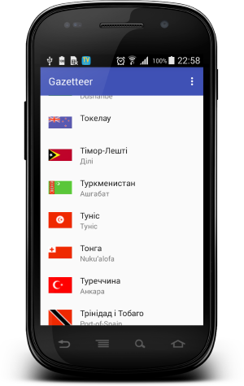

# Gazetteer

  

Simple Android App using geonames API http://www.geonames.org

The geographical dictionary of  countries. The database includes 250 countries* and flags.

#### Countries

All data are loaded from the server are stored in a SQLite database and are available without internet.

#### Used libraries:
* com.android.support:appcompat-v7:25.2.0
* com.android.support:support-v4:25.2.0
* com.android.support:recyclerview-v7:25.2.0
* com.android.support:design:25.2.0
* org.greenrobot:greendao:3.2.0
* com.squareup.retrofit2:retrofit:2.1.0
* com.squareup.retrofit2:converter-gson:2.1.0
* com.squareup.okhttp3:logging-interceptor:3.3.1
* com.facebook.fresco:fresco:1.1.0

Developed By
-------
Igor Havrylyuk (Graviton57)

[1]: https://github.com/graviton57/Gazetteer.git
